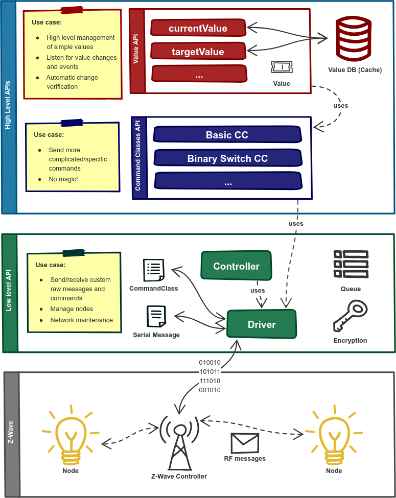

# API Overview {docsify-ignore-all}

`zwave-js` offers different high to low level APIs which give you different options depending on your use case:

## Module entry points

In addition to the root entry point `"zwave-js"`, this module provides the following secondary entry points:

-   `"zwave-js/CommandClass"`: Everything related to CCs (including the `CommandClasses` enum)
-   `"zwave-js/Controller"`: The `Controller` class as well as types and enums used in its public API
-   `"zwave-js/Driver"`: The `Driver` class and `ZWaveOptions` interface.
-   `"zwave-js/Error"`: The `ZWaveError` type and `ZWaveErrorCodes` enumeration.
-   `"zwave-js/Node"`: The `ZWaveNode` class as well as types and enums used in its public API
-   `"zwave-js/Values"`: `ValueID`, `Metadata` definitions, value event definitions and specialized value types.

Everything exported here is also exported from the root entry point.

## [Driver](api/driver.md)

The driver is the core of this library. It controls the serial interface, handles transmission and receipt of messages and manages the network cache. Any action you want to perform on the Z-Wave network must go through a driver instance or its associated nodes.

You can use the driver to directly send serial messages or command class instances.

## [Controller](api/controller.md)

The controller instance contains information about the controller and a list of its nodes.

## [ZWaveNode](api/node.md)

Each device is represented by an instance of the ZWaveNode class. Multi channel devices have multiple Endpoints, which provide access to the device's functionality.

Node instances offer an entry point to both the [Command Classes API](api/CCs/index.md) and the [Value API](api/node.md#zwavenode-methods).

## [ValueID](api/valueid.md)

Applications are usually informed about changes using value events. To identify which value has changed, a so-called value ID is used. Value IDs can also be used to set specific values without having to access the Command Class APIs.
